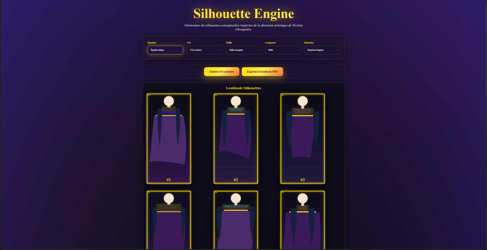

# Silhouette Engine — Générateur de silhouettes haute couture

[](https://opensource.org/licenses/MIT)

Un générateur de silhouettes conceptuelles basé sur des règles de design structurées, inspiré par l'approche architecturale de **Nicolas Ghesquière**.

---

## 🎯 Vision du projet

Ce projet explore l'intersection entre **design systémique** et **créativité contrôlée**.

Plutôt que de générer des images aléatoires par IA, le **Silhouette Engine** adopte une approche architecturale :

- Définir des règles esthétiques fortes (proportions, interdictions, équilibres)
- Créer des variations cohérentes à l’intérieur de ces contraintes
- Produire des concepts exploitables pour le prototypage et la réflexion créative

**Inspiration** : la rigueur constructive de Nicolas Ghesquière, où chaque détail structurel a une fonction et un sens.

---

## ✨ Fonctionnalités

- **5 paramètres de design** : Épaules, Col, Taille, Longueur, Manches
- **Règles de cohérence** : combinaisons interdites pour éviter les silhouettes incohérentes
- **Génération de 10 variantes** : une configuration, plusieurs interprétations visuelles
- **Export PDF** : lookbook professionnel regroupant toutes les silhouettes
- **Interface simple** : sélecteurs clairs, génération en un clic

---

## 🚀 Installation

```bash
git clone https://github.com/NagisaSano/silhouette-engine-ghesquiere.git
cd silhouette-engine-ghesquiere
```

Ouvrir simplement le fichier `index.html` dans un navigateur.

Aucune dépendance externe requise. Tout fonctionne en **JavaScript vanilla**.

---

## 🧭 Utilisation

1. Choisir les paramètres via les 5 menus déroulants  
   *(Épaules, Col, Taille, Longueur, Manches)*
2. Cliquer sur **« Générer 10 variantes »**
3. Visualiser le lookbook composé de 10 silhouettes cohérentes
4. Exporter le résultat en **PDF** pour archivage ou présentation

### Exemple de configuration

- **Configuration** : Épaules fluides · Col asymétrique · Taille haute · Mini · Sans manches  
- **Résultat** : 10 silhouettes aux variations marquées (coupes droites, évasées, asymétriques), tout en respectant la cohérence globale.

---

## 📸 Exemples

### Interface



### Lookbooks générés

**Configuration 1** : Épaules fluides + Col asymétrique + Taille haute + Mini + Sans manches

  
[📄 Télécharger le PDF](examples/example_fluide_asym_mini.pdf)

**Configuration 2** : Épaules sharp + Col oversized + Taille marquée + Midi + Manches longues

  
[📄 Télécharger le PDF](examples/example_sharp_oversized_midi.pdf)

> Chaque lookbook contient 10 silhouettes variées respectant strictement la configuration choisie, avec des différences visuelles marquées (proportions, coupes, détails).

## 🏗️ Architecture technique

### Fichiers principaux

- `index.html` — Interface utilisateur
- `silhouette.js` — Moteur de génération (règles, variations, export PDF)
- `style.css` — Design visuel (palette sombre, mise en page)

### Système de règles

```js
// Exemple de règles interdites
const forbiddenCombos = [
  { shoulder: 'volume', col: 'vneck', waist: 'low' }, // Trop de volume en haut
  { shoulder: 'sharp', length: 'mini', sleeve: 'long' } // Déséquilibre des proportions
];
```

### Variations visuelles

Chaque silhouette repose sur un **seed aléatoire**, permettant de générer :

- Largeurs d’épaules (±30px)
- Hauteurs de taille (±10px)
- Longueurs de jupe (±20px)
- Types de coupes (droite, évasée, cintrée, asymétrique)
- Palettes de couleurs (4 variations de dégradés)

---

## 🔮 Évolutions futures

### Phase 2 (court terme)

**Ce projet est un prototype évolutif.** Les règles, paramètres et fonctionnalités peuvent être adaptés selon les besoins spécifiques d'un studio de création ou d'un designer.

- [ ] Ajout de textures et matières (cuir, tech, organza)
- [ ] Intégration de moodboards (couleurs, mots-clés conceptuels)
- [ ] Export SVG haute qualité pour illustration

### Phase 3 (moyen terme)

- [ ] Module **Collections** (génération de 20–30 pièces cohérentes)
- [ ] API de connexion à des outils 3D (CLO3D, Blender)
- [ ] Contraintes saisonnières (volumes hiver / fluidité été)

### Vision long terme

- Outil de prévisualisation pour studios de design
- Pont avec des systèmes de patronage digital

---

## 🤝 Contribution

Les contributions sont bienvenues :

1. Forker le projet
2. Créer une branche (`git checkout -b feature/nouvelle-fonctionnalite`)
3. Commit (`git commit -m "feat: ajout de ..."`)
4. Push (`git push origin feature/nouvelle-fonctionnalite`)
5. Ouvrir une Pull Request

---

## 📜 Licence

Ce projet est sous licence **MIT**.  
Voir le fichier [LICENSE](LICENSE) pour plus de détails.

---

## 📬 Contact

**Killian Dujardin** — Créateur du projet  
GitHub : [@NagisaSano](https://github.com/NagisaSano)

---

*Projet développé pour explorer les systèmes de design génératif appliqués à la haute couture.*
